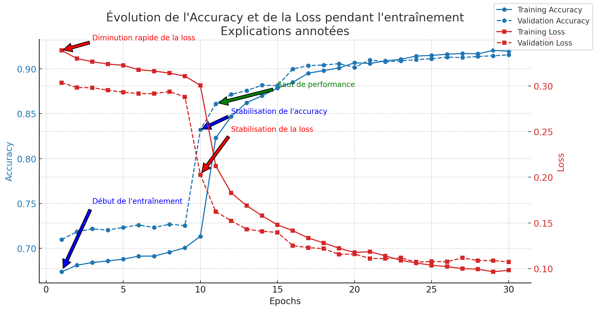

# 🛡️ Détection d'URLs malveillantes avec LSTM (Version de base)

## 📌 Description
Ce modèle a été entraîné avec **les features et labels de base**, sans ajout de nouvelles classes.  
Il vise à **classifier les URLs malveillantes** en utilisant des caractéristiques essentielles telles que :
- **Longueur de l'URL**
- **Présence de HTTPS**
- **Nombre de sous-domaines**
- **Nombre de chiffres et de caractères spéciaux**
- **Entropie de l'URL**

---

## 📊 Résultats et analyse des performances

L'évolution de l'entraînement du modèle est représentée dans le graphique ci-dessous :

### **🔍 Interprétation des résultats**
- **L'accuracy** commence autour de **67%** et atteint **91% en validation** à l’epoch 30.
- **La loss diminue progressivement**, ce qui montre une **bonne convergence du modèle**.
- **Saut de performance** à partir de l'epoch **10**, où l'accuracy passe **de 71% à 83%**.
- **Stabilisation autour de l'epoch 25**, suggérant une **convergence optimale**.

---

## 📌 Conclusion
Ce modèle **offre une performance robuste** avec ses features de base. Il peut être utilisé comme **référence** pour comparer avec des versions améliorées intégrant **de nouvelles classes ou features avancées**.

🚀 **Prochaines améliorations possibles :**  
- Ajouter **plus de données pour équilibrer les classes**.
- Tester des **modèles hybrides (LSTM + RandomForest)** pour capturer **davantage d'informations tabulaires**.

---
💡 **Développé pour une classification efficace des URLs malveillantes !**
