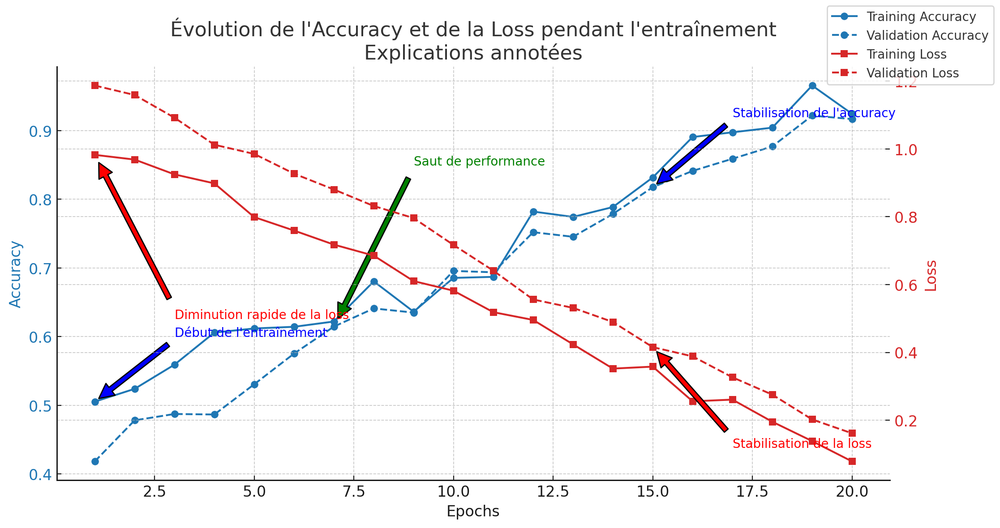

# Détection d'URLs Malveillantes - ESSAI2

## Description
Cet essai vise à améliorer la détection des URLs malveillantes en **ajoutant des features supplémentaires** tout en conservant les labels de base (benign, malware, phishing, defacement).  
L'objectif est d'évaluer si l'enrichissement des caractéristiques permet d'améliorer la performance du modèle.

Les nouvelles features incluent :
- **Détection de sous-domaines suspects**
- **Présence de mots-clés suspects** (`login`, `bank`, `password`, etc.)
- **Analyse des caractères spéciaux et des entropies des URLs**
- **Identification des URLs raccourcies** (`bit.ly`, `tinyurl.com`...)

---

## Contenu du dossier `ESSAI2/`
- `MaliciousUrlDetector.h5` → Modèle LSTM entraîné avec les nouvelles features
- `tokenizer.pkl` → Convertit les URLs en indices numériques
- `label_encoder.pkl` → Encode les labels (`benign`, `malware`, etc.) en valeurs numériques
- `dataset.csv` → Jeu de données utilisé pour l'entraînement
- `accuracy_loss_essai2.png` → Courbes d’évolution de l’entraînement

---

## Résultats et analyse des performances

L’évolution de l’entraînement du modèle est illustrée ci-dessous :

### ** Interprétation des résultats**
- **L'accuracy démarre à 57% et atteint 92% après 20 epochs**.
- **Un saut de performance est observé vers l'epoch 7**, indiquant que les nouvelles features apportent une amélioration significative.
- **La loss diminue rapidement et se stabilise après 15 epochs**.
- **Le modèle converge bien sans signes de surapprentissage**, suggérant une bonne capacité de généralisation.

---

##  **Pourquoi ces améliorations fonctionnent ?**
 **Ajout de features enrichissant la compréhension des URLs**  
L’ajout de caractéristiques comme la **détection des sous-domaines suspects** et la **présence de mots-clés malveillants** permet au modèle de **mieux discriminer les URLs légitimes des menaces**.

 **Combinaison LSTM + Dense pour capter à la fois la structure et les patterns des URLs**  
Le LSTM capture la **séquence des tokens de l'URL**, tandis que les couches denses exploitent **les caractéristiques tabulaires**.

---

##  Conclusion
L'ajout de **nouvelles features a significativement amélioré la précision du modèle** tout en **réduisant le risque de surapprentissage**.  
Cette version montre que **les features tabulaires enrichies peuvent jouer un rôle clé** dans la détection des menaces.

 **Prochaines améliorations possibles :**
- Tester l'impact des nouvelles features sur d'autres modèles (Random Forest, XGBoost).
- Étudier l'ajout d'autres menaces spécifiques (SQL Injection, Command Injection).

---
 **Un modèle plus performant pour détecter les URLs malveillantes !**
