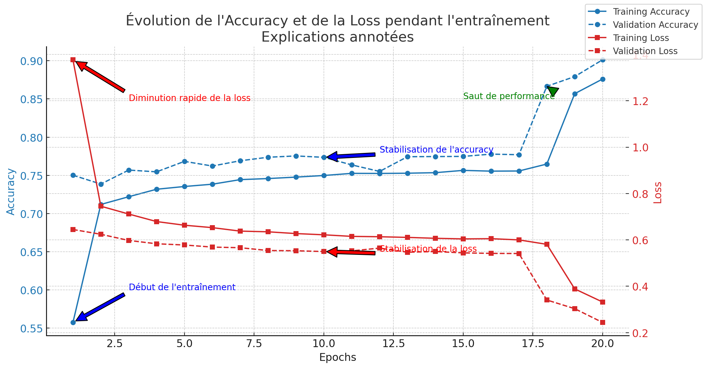

# 🛡️ Détection d'URLs malveillantes avec LSTM

## 🚀 Nouveautés
Ce modèle de détection d'URLs malveillantes a été amélioré avec **deux nouveaux labels** :
- **Path Traversal** : Identifie les attaques de type **Local File Inclusion (LFI)** utilisant des séquences comme `../etc/passwd`.
- **XSS (Cross-Site Scripting)** : Détecte les attaques injectant des scripts malveillants (``).

Ces labels ont été ajoutés tout en **conservant les features de base** du modèle initial.

---

## 📂 Génération du dataset
Le dataset a été mis à jour grâce à un **script Python** qui :
- Ajoute des **nouvelles instances** dans les catégories `path_traversal` et `xss`.
- Génère des **features supplémentaires** spécifiques à ces attaques.
- Intègre ces nouvelles instances dans le dataset existant.

📌 **Le modèle conserve toutes les features de base** (longueur de l'URL, présence de `https`, nombre de chiffres, etc.), tout en intégrant **deux nouvelles features** :
1. **Détection de patterns XSS** (`<script>`, `document.cookie`, etc.).
2. **Détection de path traversal** (`../`, `/etc/passwd`, etc.).

---

## 📊 Résultats et analyse des performances

L'évolution de l'entraînement du modèle est représentée dans le graphique ci-dessous :

### **🔍 Interprétation des résultats**
- **L'accuracy** augmente progressivement et atteint environ **90%** sur les données de validation.
- **La loss** diminue fortement, indiquant une **bonne convergence** du modèle.
- Un **saut de performance** est observé vers l'epoch **18**, probablement dû à une meilleure capture des patterns liés aux nouvelles classes.

---

## 📌 Conclusion
Ce modèle **détecte désormais 6 types de menaces**, en intégrant `path_traversal` et `xss`.  
L'ajout de ces nouvelles classes a permis une meilleure prise en compte des **attaques web modernes**, tout en **conservant les performances élevées** sur les autres catégories.

🚀 **Prochaines améliorations :**  
- Tester des **modèles hybrides (LSTM + RandomForest)** pour exploiter au mieux les features tabulaires.
- Ajouter **plus d'exemples XSS et LFI** pour équilibrer les classes.

---
💡 **Développé pour une meilleure détection des URLs malveillantes !**
